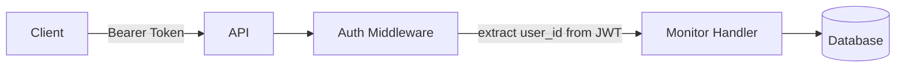
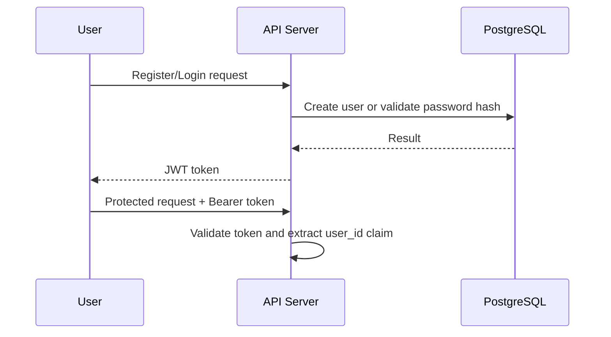

# Phase 1 Answers — Single Server MVP

> **Your answers for each challenge.**
> Compare against [docs/phase-01-single-server.md](../../docs/phase-01-single-server.md)
> only AFTER attempting every section.

---

## Challenge 1: Define the Product

**Date:** 2026-07-18 Author : "Shailendra" My answer

- product is for anyone have deployed his solution and wanted to monitor the website, or api url or anything
- customer on-boarding (login/signup)
  - able to add urls to monitor
  - able to delete urls added
  - update url endpoints
  - see current status of url (live or dead with last seen + last downtime and duration)
  - probably we need to monitor this site after every fix interval of time say 1 min and calculate the uptime (are we going to do this in phase 1, w/o this how can be it a url monitoring site? just confusion  otherwise it will be status check of website not sure with what we should move)
  - observablity, sending notification, and other tcp monitoring, cronjob or other monitoring is ourt of scope
  - i think availablity would be the top since we are monitoring the status of something and we itself went unavialble then we need snother monitoring platform how funny is this.

### What is wrong

- "For anyone" is too broad; user persona is unclear.
- P0 vs P1 priorities are not listed.
- Non-functional requirements are not measurable (no numbers for latency, availability, retention).
- MVP boundary is unclear: status check vs full uptime calculation.

### Learning

- Define one primary user persona first.
- Write strict P0 features for week-1 build, move rest to P1.
- Add measurable NFRs (example: response target, uptime target, data retention).
- Pick one MVP boundary and avoid mixing two scopes.

---

## Challenge 2: Design the API

**Date:** 2026-07-18, Author : "Shailendra" My answer

- POST /api/v1/login    200 Ok to login with credentials
- POST /api/v1/register 201 Ok to register with credentials
- POST /api/v1/{user_id}/addUrl 201 Ok
- DELETE /api/v1/{user_id}/deleteurl 200 Ok
- PUT  /api/v1/{user_id}/updateurl 200 or 204 No content
- GET  /api/v1/{user_id}/urlstatus   200 ok

we need to gracefully return the failure status code when ever we fail 4xx series or 5xx series

### What is wrong

- Endpoints are action-style (`addUrl`, `deleteurl`, `updateurl`) instead of resource-style.
- `user_id` in path duplicates identity that should come from JWT claims for normal user APIs.
- Endpoint set misses pagination strategy and consistent error response schema.
- Status code usage is incomplete and not defined per endpoint/error type.

### Learning

- Keep URLs noun-based; action comes from HTTP method.
- Use auth token as source of user identity for user-scoped APIs.
- Define one error response JSON format and use it everywhere.
- Document pagination early for list endpoints.

### Visual: Better request flow



---

## Challenge 3: Design the Database

**Date:** Author : "Shailendra" My answer

```
the main entiites must have is user/customers and urlMonitor.
User:
  - Name
  - passwd
  - no of url monitor registered
  - no of healthy
  - user_id
  
UrlMonitor:
  - url
  - curr_status
  - nick_name
  - last_dead_seen
  - last_dead_error_code/errormessage
  - created_At
  - user_id(USER) : PRIMARY KEY from USER


```

### What is wrong

- `user_id` in `UrlMonitor` should be a foreign key, not primary key.
- Primary key type decision is missing (UUID vs integer).
- Constraints are missing: unique, not null, defaults.
- No delete rule is defined (what happens to monitors when user is deleted).
- No index plan based on query patterns.

### Learning

- Model relationships explicitly: user (1) -> monitors (many).
- Decide and document PK/FK/constraint strategy before coding.
- Add indexes from real reads (filter/sort queries), not guesses.
- Separate base data from derived counters unless update strategy is clear.

---

## Challenge 4: Choose Your Tech Stack

**Date:** Author : "Shailendra" My answer

```
we are already done, we will use go, for API design we will use openapi/swagger  template and write best specs
```

### What is wrong

- Most required decisions are missing (router, DB access, migration tool, auth lib, hashing, config, validation, UUID ownership).
- No "why" per decision.

### Learning

- Tech stack answer is not tool names only; it must include reasoning and trade-offs.
- Make each choice testable against future phases (scale, maintainability, debugging).

---

## Challenge 5: Design the Project Structure

**Date:**

```
(write your answer here)
```

### What is wrong

- Section is unanswered, so architecture is not build-ready.

### Learning

- Define folder layout with clear layer boundaries: handler -> service -> repository.
- Place entrypoint, migrations, configs, and internal packages intentionally.
- Good structure reduces coupling and onboarding time.

---

## Challenge 6: Docker — Why?

**Date:**

```
to host and remove different version confict and platform issues.
```

### What is wrong

- Reason is correct but too generic.
- Missing Dockerfile strategy, multi-stage build, compose services, ports, and DB connection details.

### Learning

- Explain Docker in this project context: reproducible local setup + consistent runtime.
- Define container networking and env vars explicitly.
- Compare local build vs Docker build for reproducibility and speed.

---

## Challenge 7: Authentication Flow

**Date:**

```
will use JWTtokens...i am not familiar of authentication flow for API design
```

### What is wrong

- Flow is not described (register/login/request authentication).
- JWT claims, token location, expiry/refresh policy are missing.
- Password hashing strategy is missing.

### Learning

- Describe auth as step-by-step sequence from request to DB to response.
- Keep identity in token claims; validate token on protected routes.
- Use slow password hashing (bcrypt) for security.

### Visual: Auth sequence (high-level)



---

## Challenge 8: Error Handling Strategy

**Date:**

```
should gracefuully handle the error, we will try to handle using exception handling and returning the correct error code 
```

### What is wrong

- "Exception handling" is not accurate Go-style error handling.
- Error classes and response format are undefined.
- No panic recovery policy or internal-error masking rule is defined.

### Learning

- In Go, handle returned errors explicitly and use recovery middleware for panics.
- Standardize error payload fields for client consistency.
- Never expose internal stack details in API responses.